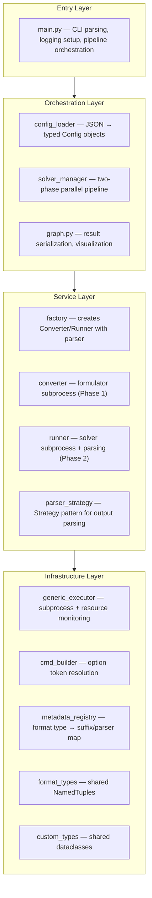
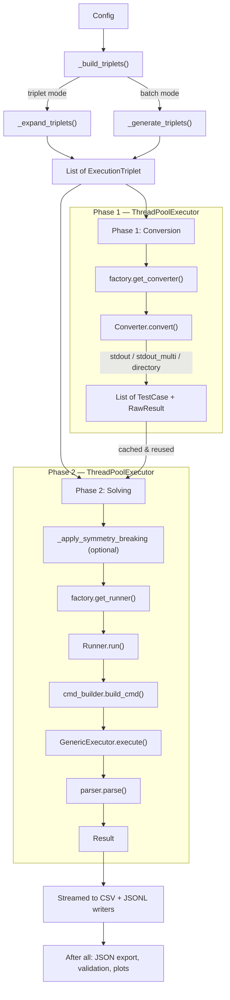
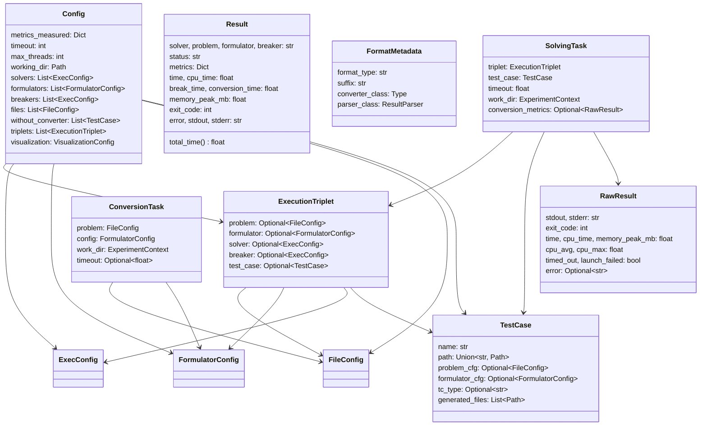
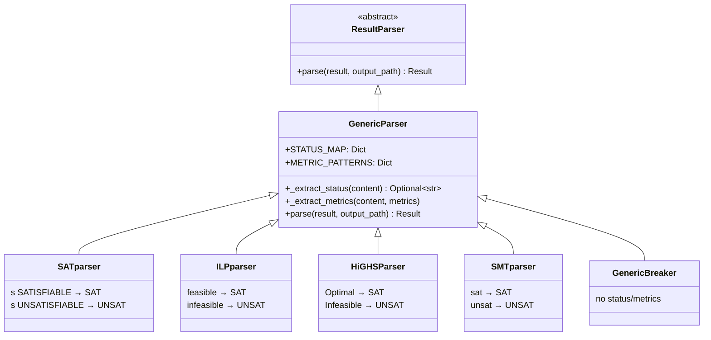

# Architecture

## Table of Contents

1. [Module Dependency Graph](#1-module-dependency-graph)
2. [Layer Architecture](#2-layer-architecture)
3. [Two-Phase Execution Pipeline](#3-two-phase-execution-pipeline)
4. [Class & Type Relationships](#4-class--type-relationships)
5. [Parser Strategy Pattern](#5-parser-strategy-pattern)
6. [Sentinel Values](#6-sentinel-values)
7. [Working Directory Structure](#7-working-directory-structure)
8. [Module Reference](#8-module-reference)
9. [Data Flow Summary](#9-data-flow-summary)
10. [Extending the Framework](#10-extending-the-framework)

---

## 1. Module Dependency Graph

Arrows show import direction (`A --> B` means A imports from B).

```mermaid
graph TD
    config_json[config.json] --> config_loader

    main.py --> config_loader
    main.py --> solver_manager
    main.py --> graph.py

    config_loader --> metadata_registry
    config_loader --> custom_types

    graph.py --> custom_types

    solver_manager --> factory
    solver_manager --> metadata_registry
    solver_manager --> converter
    solver_manager --> runner
    solver_manager --> custom_types
    solver_manager --> format_types

    factory --> converter
    factory --> runner
    factory --> parser_strategy
    factory --> metadata_registry
    factory --> custom_types

    converter --> cmd_builder
    converter --> generic_executor
    converter --> custom_types
    converter --> format_types

    runner --> cmd_builder
    runner --> generic_executor
    runner --> parser_strategy
    runner --> custom_types

    generic_executor --> custom_types

    metadata_registry --> converter
    metadata_registry --> parser_strategy
    metadata_registry --> format_types

    parser_strategy --> custom_types

    style config_json fill:#f9f,stroke:#333
    style main.py fill:#bbf,stroke:#333
    style custom_types fill:#ffd,stroke:#333
    style format_types fill:#ffd,stroke:#333
```

### Key Relationships

| Module | Imports from |
|:---|:---|
| main.py | config_loader, solver_manager, graph |
| config_loader | metadata_registry, custom_types |
| graph.py | custom_types |
| solver_manager | factory, metadata_registry, converter, runner, custom_types, format_types |
| factory | converter, runner, parser_strategy, metadata_registry, custom_types |
| converter | cmd_builder, generic_executor, custom_types, format_types |
| runner | cmd_builder, generic_executor, parser_strategy, custom_types |
| generic_executor | custom_types |
| metadata_registry | converter, parser_strategy, format_types |
| parser_strategy | custom_types |
| cmd_builder | *(no project imports)* |
| format_types | *(TYPE_CHECKING only)* |
| custom_types | *(no project imports)* |

---

## 2. Layer Architecture



---

## 3. Two-Phase Execution Pipeline



### Execution Modes

| Mode | `triplet_mode` | Behavior |
|:---|:---|:---|
| **Batch** | `false` | Full cross-product of all enabled files × formulators × solvers × breakers. Compatible types matched automatically. |
| **Triplet** | `true` | Only explicit combinations from the `triplets` array. If `solver` is omitted, expanded to all compatible enabled solvers. |

---

## 4. Class & Type Relationships



---

## 5. Parser Strategy Pattern

### Inheritance Hierarchy



### Parser Registry

| Key | Parser |
|:---|:---|
| `"SAT"` | SATparser |
| `"ILP"` | ILPparser |
| `"SMT"` | SMTparser |
| `"KISSAT"`, `"CADICAL"`, `"GLUCOSE"` | SATparser |
| `"HIGHS"` | HiGHSParser |
| `"DEFAULT"` | GenericParser |

### Parser Resolution Order

When `factory.get_runner()` creates a Runner, the parser is resolved as:

1. **Explicit key** — if `parser` is set in config, look up directly in `PARSER_REGISTRY`
2. **Type-based default** — use `FormatMetadata.parser_class` from `FORMAT_REGISTRY`
3. **Fallback** — `GenericParser` (no status/metric extraction)

### Adding a Custom Parser

Subclass `GenericParser` and define `STATUS_MAP` and `METRIC_PATTERNS`:

```python
class MyCustomParser(GenericParser):
    STATUS_MAP = {
        "s SATISFIABLE": "SAT",
        "s UNSATISFIABLE": "UNSAT",
    }
    METRIC_PATTERNS = {
        "conflicts": [r"Conflicts:\s+(\d+)"],
    }
```

Register it and reference from config:

```python
PARSER_REGISTRY["MY_KEY"] = MyCustomParser()
```

```json
"my_solver": {"type": "SAT", "parser": "MY_KEY", "cmd": "..."}
```

> **Note**: STATUS_MAP keys are matched as substrings in order. If one key is a substring of another (e.g. `"feasible"` inside `"infeasible"`), the more specific key must come first — first match wins.

---

## 6. Sentinel Values

Internal sentinel strings represent "not applicable" components:

| Sentinel | Value | Used for |
|:---|:---|:---|
| `NULL_FORMULATOR` | `"NULL_FORMULATOR"` | Pre-encoded files that skip conversion |
| `NULL_BREAKER` | `"NULL_BREAKER"` | Solver runs without symmetry breaking |

Both are converted to `"None"` at the output boundary by `_flatten_result()` in `graph.py` before writing to CSV/JSON. This keeps internal logic clean (can compare against a known sentinel) while output remains user-friendly.

---

## 7. Working Directory Structure

Always follows `problem / formulator / logs`, even for pre-encoded files:

```
{working_dir}/
├── {problem_name}/
│   └── {formulator_name}/              ← or NULL_FORMULATOR
│       ├── {problem_name}{suffix}      ← converted formula file
│       └── logs/
│           ├── {tc}.{solver}.out       ← without breaker
│           └── {tc}.{solver}_{brk}.out ← with breaker
```

Example:

```
/tmp/sat/
├── hamilton_1/
│   └── SAT_hamilton/
│       ├── hamilton_1.cnf
│       └── logs/
│           ├── hamilton_1.kissat_cmd_breakid.out
│           └── hamilton_1.cadical_cmd.out
└── hamilton_wc/
    └── NULL_FORMULATOR/
        └── logs/
            └── hamilton_wc.Glucose.out
```

---

## 8. Module Reference

| Module | Layer | Responsibility |
|:---|:---|:---|
| `main.py` | Entry | CLI argument parsing (`--config`, `--verbose`), logging setup, pipeline orchestration |
| `config_loader.py` | Orchestration | JSON config loading, validation, parsing into typed objects, path resolution |
| `solver_manager.py` | Orchestration | Two-phase parallel pipeline, triplet generation/expansion, working directory setup |
| `graph.py` | Orchestration | CSV/JSONL/JSON result export, plot generation, status conflict validation |
| `factory.py` | Service | Creates `Converter` and `Runner` instances with correct parser resolution |
| `converter.py` | Service | Runs formulator subprocesses (stdout, stdout_multi, directory modes) |
| `runner.py` | Service | Runs solver subprocesses, maps `RawResult` → `Result`, applies parser |
| `parser_strategy.py` | Service | `ResultParser` ABC, `GenericParser`, solver-specific parsers, `PARSER_REGISTRY` |
| `generic_executor.py` | Infrastructure | Low-level subprocess execution with CPU/memory monitoring via `psutil` |
| `cmd_builder.py` | Infrastructure | Resolves `{input}`, `{output}`, `<`, `>` tokens into subprocess commands |
| `metadata_registry.py` | Infrastructure | `FORMAT_REGISTRY` mapping type strings to suffixes, converters, default parsers |
| `format_types.py` | Infrastructure | Shared NamedTuples: `FormatMetadata`, `ExperimentContext`, `ConversionTask`, `SolvingTask` |
| `custom_types.py` | Infrastructure | All dataclasses: `Config`, `Result`, `RawResult`, `ExecConfig`, `TestCase`, etc. |
| `plot_metric.py` | Standalone | Post-run CLI plotter for any numeric CSV column (bar charts, box plots) |

---

## 9. Data Flow Summary

1. **main.py** parses CLI args (`--config`, `--verbose`), configures logging, loads config via `config_loader`
2. **config_loader** reads JSON, validates structure, parses each section into typed objects once, builds name→object lookup dicts for triplet resolution
3. **solver_manager** receives `Config`, sets up working directory, generates execution triplets (batch cross-product or explicit triplet mode)
4. **Phase 1 — Conversion**: `_worker_convert` calls `factory.get_converter()` → `Converter.convert()` → `cmd_builder.build_cmd()` → `GenericExecutor.execute()`. Respects global timeout. Returns `List[TestCase]` + `RawResult`. Results are cached per (problem, formulator) pair
5. **Phase 2 — Solving**: `_worker_solve` optionally runs symmetry breaking via `_apply_symmetry_breaking`, then calls `factory.get_runner()` → `Runner.run()` → `cmd_builder.build_cmd()` → `GenericExecutor.execute()` → `ResultParser.parse()`. Returns `Result` with status and metrics
6. Each `Result` is **streamed** to CSV and JSONL writers as it completes (crash-safe incremental output)
7. After all tasks finish: structured JSON export, status conflict validation across solvers, optional plot generation

---

## 10. Extending the Framework

### 10.1 Adding a New Solver

#### SAT Solver

1. Place the binary in `solver_exec/` or install system-wide
2. Add to `config.json`:
```json
"minisat": {
    "type": "SAT",
    "cmd": "./solver_exec/minisat",
    "enabled": true,
    "options": ["{input}", ">"],
    "parser": "SAT"
}
```

#### ILP Solver

```json
"scip": {
    "type": "ILP",
    "cmd": "scip",
    "enabled": true,
    "options": ["-f", "{input}"],
    "parser": "ILP"
}
```

#### Custom Parser Strategy

If a solver has a unique output format, define a custom parser in `src/parser_strategy.py`.

**1. Define the Parser Class**

The simplest approach is to subclass `GenericParser` and define `STATUS_MAP` and `METRIC_PATTERNS`:

```python
class MyCustomParser(GenericParser):
    STATUS_MAP = {
        "s SATISFIABLE": "SAT",
        "s UNSATISFIABLE": "UNSAT",
    }
    METRIC_PATTERNS = {
        "conflicts": [r"Conflicts:\s+(\d+)"],
        "my_metric": [r"CustomValue\s*=\s*([\d\.]+)"]
    }
```

**`STATUS_MAP`** — maps a substring to a status string. The parser scans stdout (and the output file if status remains UNKNOWN) for each key in order. The first match wins.

> **Note**: If one key is a substring of another (e.g. `"feasible"` inside `"unfeasible"`), the more specific key must appear first in the dict to avoid false matches.

| Key | Value |
|:---|:---|
| Any substring present in solver output | `"SAT"`, `"UNSAT"`, `"TIMEOUT"`, or `"UNKNOWN"` |

**`METRIC_PATTERNS`** — maps a metric name to a list of regex patterns tried in order. The first pattern that matches extracts capture group 1 as the metric value. Multiple patterns allow the same metric to be parsed from different solver output formats.

```python
METRIC_PATTERNS = {
    "conflicts": [
        r"^\s*c?\s*nb\s+conflicts\s*:\s*(\d+)",  # Glucose style
        r"^\s*c?\s*conflicts\s*:\s*(\d+)",        # Kissat / CaDiCaL style
    ],
    "decisions": [
        r"^\s*c?\s*decisions\s*:\s*(\d+)",
    ]
}
```

Metric names must match keys in `metrics_measured` in `config.json` to appear in the CSV output.

**2. Override `parse()` for Full Control**

If the solver output requires more complex logic — multi-line parsing, conditional status, computed metrics — override `parse()` directly:

```python
class MyCustomParser(ResultParser):
    def parse(self, result: Result, output_path: Optional[Path] = None) -> Result:
        content = result.stdout
        if output_path and output_path.exists():
            content = output_path.read_text()

        # UNSATISFIABLE must be checked first — it contains SATISFIABLE as a substring
        if "UNSATISFIABLE" in content:
            result.status = "UNSAT"
        elif "SATISFIABLE" in content:
            result.status = "SAT"

        match = re.search(r"conflicts\s*=\s*(\d+)", content)
        if match:
            result.metrics["conflicts"] = int(match.group(1))

        return result
```

**3. Register the Parser**

```python
PARSER_REGISTRY = {
    "MY_CUSTOM_KEY": MyCustomParser(),
    ...
}
```

**4. Use it in `config.json`**

```json
"MySpecialSolver": {
    "cmd": "./solvers/my_solver",
    "type": "SAT",
    "parser": "MY_CUSTOM_KEY",
    "enabled": true
}
```

> **Parser resolution**: If `parser` is omitted, the framework resolves it in `factory.py` — first checking the explicit key, then falling back to the type-based default from `metadata_registry.py`. See [Parser Strategy Pattern](#5-parser-strategy-pattern) for the full hierarchy.

### 10.2 Adding a New Formulator

1. Create a script that reads a problem file and outputs the formula to stdout
2. The script must accept the problem file path as a command-line argument
3. Add to `config.json`:

```json
"my_formulator": {
    "type": "SAT",
    "cmd": "./my_scripts/my_formulator.py",
    "enabled": true,
    "output_mode": "stdout",
    "options": ["{input}"]
}
```

4. Make the script executable: `chmod +x my_scripts/my_formulator.py`

### 10.3 Adding a New Format Type

The format registry in `metadata_registry.py` maps type strings (e.g. `SAT`, `ILP`) to their file suffix, converter class, and default parser. To add a new format type:

**1. Create a parser (if needed)**

If the new format has a unique output style, add a parser in `parser_strategy.py` (see [Custom Parser Strategy](#custom-parser-strategy)). Otherwise, reuse an existing one or `GenericParser`.

**2. Register the format type**

Add an entry to `FORMAT_REGISTRY` in `src/metadata_registry.py`:

```python
from parser_strategy import MyNewParser

FORMAT_REGISTRY: Dict[str, FormatMetadata] = {
    "SAT": FormatMetadata(format_type="SAT", suffix=".cnf", converter_class=Converter, parser_class=SATparser()),
    "ILP": FormatMetadata(format_type="ILP", suffix=".lp",  converter_class=Converter, parser_class=ILPparser()),
    "SMT": FormatMetadata(format_type="SMT", suffix=".smt2", converter_class=Converter, parser_class=SMTparser()),
    # Add your new type here:
    "MAXSAT": FormatMetadata(format_type="MAXSAT", suffix=".wcnf", converter_class=Converter, parser_class=MyNewParser()),
    ...
}
```

Each entry defines:

| Field | Description |
|:---|:---|
| `format_type` | Canonical type string — must match the key and the `type` field used in config |
| `suffix` | File extension for converted formula files (must be unique across all types) |
| `converter_class` | Converter class used to produce files of this type (usually `Converter`) |
| `parser_class` | Default parser instance used when no explicit `parser` key is set on a solver |

**3. Use it in config**

Reference the new type in formulators, solvers, and breakers:

```json
"my_formulator": {
    "type": "MAXSAT",
    "cmd": "./formulator/maxsat_encoder.py",
    "enabled": true
},
"my_solver": {
    "type": "MAXSAT",
    "cmd": "./solver_exec/maxsat_solver",
    "enabled": true
}
```

Pre-encoded files with the registered suffix (`.wcnf`) are auto-detected:

```json
"my_problem": {"path": "./examples/problem.wcnf"}
```

For unrecognized extensions, specify `type` explicitly:

```json
"my_problem": {"path": "./examples/problem.txt", "type": "MAXSAT"}
```

**4. Tests pick it up automatically**

`TestFormatRegistryContract` in `tests/unit/test_metadata_registry.py` automatically validates every entry in `FORMAT_REGISTRY` — no test changes needed.

> **Note**: Each suffix must be unique across all format types. If two types share the same suffix, only the last one in the dict will be used for auto-detection from file extensions.

### 10.4 Adding Tests

#### Adding tests for a new parser

Subclass `ParserContractBase` in `tests/unit/test_parser_strategy.py`:

```python
class TestMyParserContract(ParserContractBase):
    parser = MyParser()
    sat_output = "MY SAT OUTPUT"
    unsat_output = "MY UNSAT OUTPUT"
```

#### Adding tests for a new format type

Add the type to `FORMAT_REGISTRY` in `metadata_registry.py` — `TestFormatRegistryContract` in `tests/unit/test_metadata_registry.py` will automatically pick it up and validate it.
