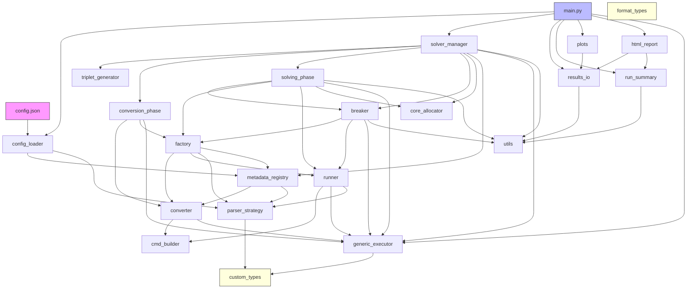
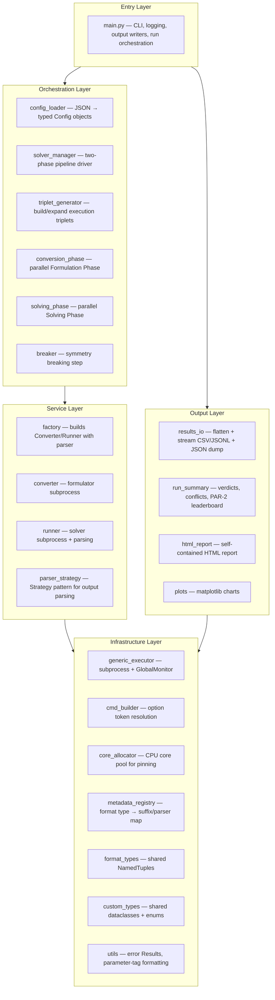
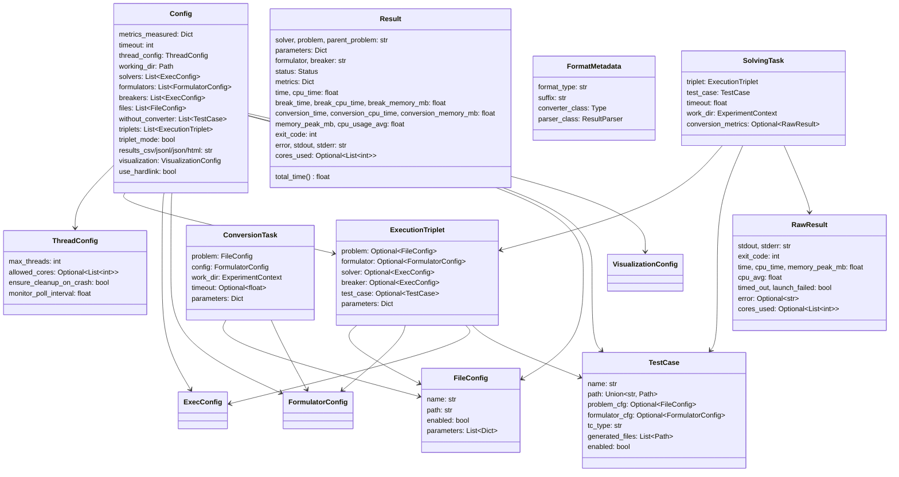
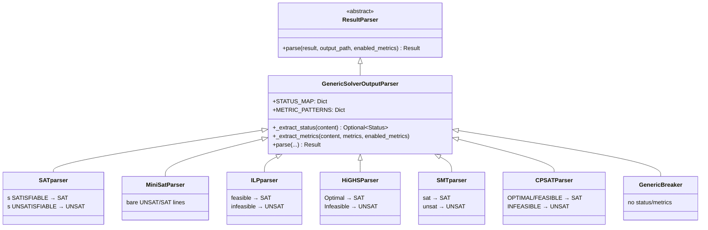

# Architecture

## Table of Contents

1. [Module Dependency Graph](#1-module-dependency-graph)
2. [Layer Architecture](#2-layer-architecture)
3. [Two-Phase Execution Pipeline](#3-two-phase-execution-pipeline)
4. [Class & Type Relationships](#4-class--type-relationships)
5. [Parser Strategy Pattern](#5-parser-strategy-pattern)
6. [Sentinel Values](#6-sentinel-values)
7. [Working Directory Structure](#7-working-directory-structure)
8. [Module Reference](#8-module-reference)
9. [Data Flow Summary](#9-data-flow-summary)
10. [Extending the Framework](#10-extending-the-framework)

---

## 1. Module Dependency Graph

Arrows show import direction (`A --> B` means A imports from B). `custom_types`,
`format_types`, `cmd_builder`, and `core_allocator` are leaf modules with no
project imports (omitted as targets in most edges to keep the graph readable).


```mermaid
graph TD
    config_json[config.json] --> config_loader

    main[main.py] --> config_loader
    main --> solver_manager
    main --> results_io
    main --> run_summary
    main --> plots
    main --> html_report
    main --> generic_executor

    config_loader --> metadata_registry
    config_loader --> parser_strategy

    solver_manager --> triplet_generator
    solver_manager --> conversion_phase
    solver_manager --> solving_phase
    solver_manager --> breaker
    solver_manager --> core_allocator
    solver_manager --> metadata_registry
    solver_manager --> generic_executor
    solver_manager --> utils

    conversion_phase --> converter
    conversion_phase --> factory
    conversion_phase --> generic_executor

    solving_phase --> breaker
    solving_phase --> factory
    solving_phase --> runner
    solving_phase --> core_allocator
    solving_phase --> generic_executor
    solving_phase --> utils

    breaker --> factory
    breaker --> runner
    breaker --> generic_executor
    breaker --> utils

    factory --> converter
    factory --> runner
    factory --> parser_strategy
    factory --> metadata_registry

    converter --> cmd_builder
    converter --> generic_executor

    runner --> cmd_builder
    runner --> generic_executor
    runner --> parser_strategy

    metadata_registry --> converter
    metadata_registry --> parser_strategy

    generic_executor --> custom_types
    parser_strategy --> custom_types

    html_report --> results_io
    html_report --> run_summary
    plots --> results_io
    results_io --> utils
    run_summary --> utils

    style config_json fill:#f9f,stroke:#333
    style main fill:#bbf,stroke:#333
    style custom_types fill:#ffd,stroke:#333
    style format_types fill:#ffd,stroke:#333
```

### Key Relationships

| Module | Imports from (project modules) |
|:---|:---|
| `main` | config_loader, solver_manager, generic_executor, results_io, run_summary, plots, html_report, custom_types |
| `config_loader` | metadata_registry, parser_strategy, custom_types |
| `solver_manager` | triplet_generator, conversion_phase, solving_phase, breaker, core_allocator, metadata_registry, generic_executor, utils, custom_types, format_types |
| `triplet_generator` | custom_types |
| `conversion_phase` | converter, factory, generic_executor, custom_types, format_types |
| `solving_phase` | breaker, factory, runner, core_allocator, generic_executor, utils, custom_types, format_types |
| `breaker` | factory, runner, generic_executor, utils, custom_types, format_types |
| `factory` | converter, runner, parser_strategy, metadata_registry, generic_executor, custom_types, format_types |
| `converter` | cmd_builder, generic_executor, custom_types, format_types |
| `runner` | cmd_builder, generic_executor, parser_strategy, custom_types |
| `metadata_registry` | converter, parser_strategy, format_types |
| `parser_strategy` | custom_types |
| `generic_executor` | custom_types |
| `results_io` | custom_types, utils |
| `run_summary` | custom_types, utils |
| `plots` | results_io, custom_types |
| `html_report` | results_io, run_summary, custom_types |
| `utils` | custom_types |
| `cmd_builder`, `core_allocator` | *(no project imports)* |
| `format_types` | *(TYPE_CHECKING only)* |
| `custom_types` | *(no project imports; `TestCase.__post_init__` lazily imports `metadata_registry` to avoid a cycle)* |

---

## 2. Layer Architecture


```mermaid
graph TD
    subgraph Entry["Entry Layer"]
        main["main.py — CLI, logging, output writers, run orchestration"]
    end

    subgraph Orchestration["Orchestration Layer"]
        cl["config_loader — JSON → typed Config objects"]
        sm["solver_manager — two-phase pipeline driver"]
        tg["triplet_generator — build/expand execution triplets"]
        cp["conversion_phase — parallel Formulation Phase"]
        sp["solving_phase — parallel Solving Phase"]
        br["breaker — symmetry breaking step"]
    end

    subgraph Service["Service Layer"]
        fa["factory — builds Converter/Runner with parser"]
        co["converter — formulator subprocess"]
        ru["runner — solver subprocess + parsing"]
        ps["parser_strategy — Strategy pattern for output parsing"]
    end

    subgraph Output["Output Layer"]
        rio["results_io — flatten + stream CSV/JSONL + JSON dump"]
        rs["run_summary — verdicts, conflicts, PAR-2 leaderboard"]
        hr["html_report — self-contained HTML report"]
        pl["plots — matplotlib charts"]
    end

    subgraph Infrastructure["Infrastructure Layer"]
        ge["generic_executor — subprocess + GlobalMonitor"]
        cb["cmd_builder — option token resolution"]
        ca["core_allocator — CPU core pool for pinning"]
        mr["metadata_registry — format type → suffix/parser map"]
        ft["format_types — shared NamedTuples"]
        ct["custom_types — shared dataclasses + enums"]
        ut["utils — error Results, parameter-tag formatting"]
    end

    Entry --> Orchestration --> Service --> Infrastructure
    Entry --> Output
    Output --> Infrastructure
```

---

## 3. Two-Phase Execution Pipeline

```mermaid
graph TD
    Config --> BT["triplet_generator.build_triplets()"]
    BT -->|triplet mode| EX["_expand_triplets()"]
    BT -->|batch mode| GEN["_generate_triplets()"]
    EX --> triplets["List of ExecutionTriplet"]
    GEN --> triplets

    triplets --> P1["Formulation Phase"]
    triplets --> P2["Solving Phase"]

    subgraph FormulationPhase["conversion_phase.run_conversion_phase — ThreadPoolExecutor"]
        P1 --> FC["factory.get_converter()"]
        FC --> CV["Converter.convert()"]
        CV -->|stdout / stdout_multi / directory| TC["List of TestCase + RawResult"]
    end

    subgraph SolvingPhase["solving_phase.SolvingPhase.run — ThreadPoolExecutor"]
        P2 --> CA["CoreAllocator.request() (if pinning)"]
        CA --> SB["SymmetryBreaker.apply() (optional)"]
        SB --> FR["factory.get_runner()"]
        FR --> RR["Runner.run()"]
        RR --> BC["cmd_builder.build_cmd()"]
        BC --> GE["GenericExecutor.execute()"]
        GE --> PP["parser.parse()"]
        PP --> RES["Result"]
    end

    TC -->|cached & reused, keyed by (problem, formulator, parameters)| P2
    RES -->|each result| stream["results_io: streamed to CSV + JSONL"]
    stream --> final["After all: JSON dump, run_summary (verdicts/leaderboard), plots, HTML report"]
```

### Execution Modes

| Mode | `triplet_mode` | Behavior |
|:---|:---|:---|
| **Batch** | `false` | Full cross-product of all enabled files × parameter instances × formulators × solvers × breakers. Compatible types matched automatically. |
| **Triplet** | `true` | Only explicit combinations from the `triplets` array. If `solver` is omitted, expanded to all compatible enabled solvers. |

Both modes expand each problem's `parameters` list into one independent instance
per parameter dict (a problem with no `parameters` yields a single
no-parameters instance — the legacy behaviour).

---

## 4. Class & Type Relationships


```mermaid
classDiagram
    class Config {
        metrics_measured: Dict
        timeout: int
        thread_config: ThreadConfig
        working_dir: Path
        solvers: List~ExecConfig~
        formulators: List~FormulatorConfig~
        breakers: List~ExecConfig~
        files: List~FileConfig~
        without_converter: List~TestCase~
        triplets: List~ExecutionTriplet~
        triplet_mode: bool
        results_csv/jsonl/json/html: str
        visualization: VisualizationConfig
        use_hardlink: bool
    }

    class ThreadConfig {
        max_threads: int
        allowed_cores: Optional~List~int~~
        ensure_cleanup_on_crash: bool
        monitor_poll_interval: float
    }

    class FileConfig {
        name: str
        path: str
        enabled: bool
        parameters: List~Dict~
    }

    class ExecutionTriplet {
        problem: Optional~FileConfig~
        formulator: Optional~FormulatorConfig~
        solver: Optional~ExecConfig~
        breaker: Optional~ExecConfig~
        test_case: Optional~TestCase~
        parameters: Dict
    }

    class TestCase {
        name: str
        path: Union~str, Path~
        problem_cfg: Optional~FileConfig~
        formulator_cfg: Optional~FormulatorConfig~
        tc_type: str
        generated_files: List~Path~
        enabled: bool
    }

    class Result {
        solver, problem, parent_problem: str
        parameters: Dict
        formulator, breaker: str
        status: Status
        metrics: Dict
        time, cpu_time: float
        break_time, break_cpu_time, break_memory_mb: float
        conversion_time, conversion_cpu_time, conversion_memory_mb: float
        memory_peak_mb, cpu_usage_avg: float
        exit_code: int
        error, stdout, stderr: str
        cores_used: Optional~List~int~~
        total_time() float
    }

    class RawResult {
        stdout, stderr: str
        exit_code: int
        time, cpu_time, memory_peak_mb: float
        cpu_avg: float
        timed_out, launch_failed: bool
        error: Optional~str~
        cores_used: Optional~List~int~~
    }

    class FormatMetadata {
        format_type: str
        suffix: str
        converter_class: Type
        parser_class: ResultParser
    }

    class ConversionTask {
        problem: FileConfig
        config: FormulatorConfig
        work_dir: ExperimentContext
        timeout: Optional~float~
        parameters: Dict
    }

    class SolvingTask {
        triplet: ExecutionTriplet
        test_case: TestCase
        timeout: float
        work_dir: ExperimentContext
        conversion_metrics: Optional~RawResult~
    }

    Config --> ThreadConfig
    Config --> ExecutionTriplet
    Config --> ExecConfig
    Config --> FormulatorConfig
    Config --> FileConfig
    Config --> TestCase
    Config --> VisualizationConfig
    ExecutionTriplet --> FileConfig
    ExecutionTriplet --> FormulatorConfig
    ExecutionTriplet --> ExecConfig
    ExecutionTriplet --> TestCase
    ConversionTask --> FileConfig
    ConversionTask --> FormulatorConfig
    SolvingTask --> ExecutionTriplet
    SolvingTask --> TestCase
    SolvingTask --> RawResult
```

`Status` is a `str`-valued `Enum` (`SAT`, `UNSAT`, `OK`, `TIMEOUT`, `ERROR`,
`EXIT_ERROR`, `MISSING_OUTPUT`, `PARSER_ERROR`, `BREAKER_ERROR`, `UNKNOWN`).
`RunOutcome` (`COMPLETED` / `INTERRUPTED` / `ERROR`) describes how the whole run
ended and is distinct from a single solver's `Status`. `PlotResult` carries the
plot file paths produced by a run (`comparison` list + `per_problem` map keyed by
`(instance, params_tag)`).

---

## 5. Parser Strategy Pattern

### Inheritance Hierarchy


```mermaid
classDiagram
    class ResultParser {
        <<abstract>>
        +parse(result, output_path, enabled_metrics) Result
    }

    class GenericSolverOutputParser {
        +STATUS_MAP: Dict
        +METRIC_PATTERNS: Dict
        +_extract_status(content) Optional~Status~
        +_extract_metrics(content, metrics, enabled_metrics)
        +parse(...) Result
    }

    class SATparser {
        s SATISFIABLE → SAT
        s UNSATISFIABLE → UNSAT
    }
    class MiniSatParser {
        bare UNSAT/SAT lines
    }
    class ILPparser {
        feasible → SAT
        infeasible → UNSAT
    }
    class HiGHSParser {
        Optimal → SAT
        Infeasible → UNSAT
    }
    class SMTparser {
        sat → SAT
        unsat → UNSAT
    }
    class CPSATParser {
        OPTIMAL/FEASIBLE → SAT
        INFEASIBLE → UNSAT
    }
    class GenericBreaker {
        no status/metrics
    }

    ResultParser <|-- GenericSolverOutputParser
    GenericSolverOutputParser <|-- SATparser
    GenericSolverOutputParser <|-- MiniSatParser
    GenericSolverOutputParser <|-- ILPparser
    GenericSolverOutputParser <|-- HiGHSParser
    GenericSolverOutputParser <|-- SMTparser
    GenericSolverOutputParser <|-- CPSATParser
    GenericSolverOutputParser <|-- GenericBreaker
```

### Parser Registry

`PARSER_REGISTRY` (keys are matched case-insensitively):

| Key | Parser |
|:---|:---|
| `SAT` | SATparser |
| `ILP` | ILPparser |
| `SMT` | SMTparser |
| `CPSAT` | CPSATParser |
| `CADICAL`, `KISSAT`, `GLUCOSE`, `LINGELING` | SATparser |
| `MINISAT` | MiniSatParser |
| `HIGHS` | HiGHSParser |
| `DEFAULT` | GenericSolverOutputParser |

### Performance notes

- `METRIC_PATTERNS` are compiled **once per subclass** in `__init_subclass__`, so
  no per-parse regex compilation cost is paid.
- Parsing reads only a bounded head + tail slice (`_PARSE_BYTES = 64 KiB`) of
  both stdout and the output file, so multi-megabyte logs don't dominate parse time.
- `enabled_metrics` (computed once from `metrics_measured`) is forwarded to every
  `parse()` call; disabled metrics skip their regex entirely. `None` means "extract
  everything" (used in tests).

### Parser Resolution Order

When `factory.get_runner()` creates a Runner, the parser is resolved as:

1. **Explicit key** — if `parser` is set in config, look it up (uppercased) in `PARSER_REGISTRY`.
2. **Type-based default** — use `FormatMetadata.parser_class` from `FORMAT_REGISTRY`.
3. **Fallback** — `GenericSolverOutputParser` (no status/metric extraction).

> **Note**: STATUS_MAP keys are matched as substrings in order. If one key is a
> substring of another (e.g. `FEASIBLE` inside `INFEASIBLE`, or `SAT` inside
> `UNSAT`), the more specific key must come first — first match wins.

---

## 6. Sentinel Values

Internal sentinel strings represent "not applicable" components:

| Sentinel | Value | Used for |
|:---|:---|:---|
| `NULL_FORMULATOR` | `"NULL_FORMULATOR"` | Pre-encoded files that skip conversion |
| `NULL_BREAKER` | `"NULL_BREAKER"` | Solver runs without symmetry breaking |
| `NULL_PROBLEM` | `"NULL_PROBLEM"` | Defensive default; a real run should never surface it |
| `NULL_SOLVER` | `"NULL_SOLVER"` | Defensive default; a real run should never surface it |

`NULL_FORMULATOR` and `NULL_BREAKER` are converted to `"None"` at the output
boundary by `_flatten_result()` in **`results_io.py`** before writing to
CSV/JSONL/JSON/HTML. This keeps internal logic clean (compare against a known
sentinel) while output stays user-friendly.

---

## 7. Working Directory Structure

Always follows `instance / formulator / logs`, even for pre-encoded files. The
*instance* directory is the bare problem name when it has no parameters, or
`problem@k=v,k=v` (keys sorted) for one parameter-sweep instance — so each
`(problem, parameters)` pair gets its own files:

```
{working_dir}/
├── {instance}/                          ← {problem} or {problem}@{params_tag}
│   └── {formulator_name}/               ← or NULL_FORMULATOR
│       ├── {problem_name}{suffix}       ← converted formula file
│       └── logs/
│           ├── {tc}.{solver}.out        ← without breaker
│           └── {tc}.{solver}_{brk}.out  ← with breaker
```

Example:

```
/tmp/sat/
├── hamilton_1/
│   └── SAT_hamilton/
│       ├── hamilton_1.cnf
│       └── logs/
│           ├── hamilton_1.kissat_cmd_breakid.out
│           └── hamilton_1.cadical_cmd.out
├── petersen@p=5,q=2/
│   └── circular_SAT/
│       ├── petersen.cnf
│       └── logs/
│           └── petersen.kissat_cmd.out
└── hamilton_wc/
    └── NULL_FORMULATOR/
        └── logs/
            └── hamilton_wc.Glucose.out
```

When a solver task runs, its input file is hardlinked or copied to a
per-solver name (`{stem}.{solver}{suffix}`) so concurrent solvers never read a
file another task is replacing; these copies are deleted after the Solving Phase.

---

## 8. Module Reference

| Module | Layer | Responsibility |
|:---|:---|:---|
| `main.py` | Entry | CLI parsing (`--config`, `--verbose`), logging setup, output writers, run orchestration, summary/plots/HTML |
| `config_loader.py` | Orchestration | JSON config loading, validation, parsing into typed objects, relative-path resolution |
| `solver_manager.py` | Orchestration | Drives the two-phase pipeline; working-directory setup; conversion deduplication; task building; file cleanup |
| `triplet_generator.py` | Orchestration | Builds execution triplets — batch cross-product or explicit triplet-mode expansion; parameter sweeps |
| `conversion_phase.py` | Orchestration | Formulation Phase — converts each unique `(problem, formulator, parameters)` instance in parallel |
| `solving_phase.py` | Orchestration | Solving Phase — runs solvers (with optional breaking) in parallel; core allocation; per-result callback |
| `breaker.py` | Orchestration | `SymmetryBreaker` — runs a breaker binary, validates its output, produces a new TestCase |
| `factory.py` | Service | Creates `Converter` and `Runner` instances with correct parser resolution |
| `converter.py` | Service | Runs formulator subprocesses (`stdout`, `stdout_multi`, `directory` modes) |
| `runner.py` | Service | Runs solver subprocesses, maps `RawResult` → `Result`, applies the parser |
| `parser_strategy.py` | Service | `ResultParser` ABC, `GenericSolverOutputParser`, solver-specific parsers, `PARSER_REGISTRY` |
| `generic_executor.py` | Infrastructure | Low-level subprocess execution; `GlobalMonitor` singleton tracks CPU/memory over the process tree |
| `cmd_builder.py` | Infrastructure | Resolves `{input}`, `{output}`, `{key}`, `<`, `>` tokens into subprocess commands |
| `core_allocator.py` | Infrastructure | Thread-safe pool that hands out CPU cores for `taskset` pinning |
| `metadata_registry.py` | Infrastructure | `FORMAT_REGISTRY` mapping type strings to suffixes, converters, default parsers |
| `format_types.py` | Infrastructure | Shared NamedTuples: `FormatMetadata`, `ExperimentContext`, `ConversionTask`, `SolvingTask` |
| `custom_types.py` | Infrastructure | Dataclasses + enums: `Config`, `Result`, `RawResult`, `Status`, `RunOutcome`, `ExecConfig`, `TestCase`, … |
| `utils.py` | Infrastructure | `make_error_result()`, `format_parameters_tag()`, `instance_dir_name()` |
| `results_io.py` | Output | Result flattening, streaming CSV/JSONL writers, structured JSON dump, CSV read-back |
| `run_summary.py` | Output | Per-instance verdicts, conflict detection, PAR-2 leaderboard, console rendering |
| `html_report.py` | Output | Self-contained sortable/filterable HTML report (table, summary, plots) |
| `plots.py` | Output | Matplotlib charts: per-instance time breakdown, status counts, CPU box, cactus |
| `plot_metric.py` | Standalone | Post-run CLI plotter for any numeric CSV column (bar charts, box plots) |

---

## 9. Data Flow Summary

1. **main.py** parses CLI args, configures logging, loads config via `config_loader`,
   and opens the streaming CSV + JSONL writers (`results_io.create_all_writers`).
2. **config_loader** reads JSON, validates structure, resolves relative paths against
   the config file's directory, parses each section into typed objects, and builds
   name→object lookups for triplet resolution.
3. **solver_manager** receives `Config`, sets up the working directory, and asks
   `triplet_generator.build_triplets` for the execution triplets (batch cross-product
   or explicit triplet mode, with parameter sweeps expanded).
4. **Formulation Phase** (`conversion_phase.run_conversion_phase`): each unique
   `(problem, formulator, parameters)` instance is converted once in parallel via
   `factory.get_converter()` → `Converter.convert()` → `cmd_builder.build_cmd()` →
   `GenericExecutor.execute()`. Results are cached and reused across solvers.
5. **Solving Phase** (`solving_phase.SolvingPhase.run`): for each `SolvingTask`,
   `CoreAllocator` (if pinning) reserves cores, `SymmetryBreaker.apply()` optionally
   runs a breaker, then `factory.get_runner()` → `Runner.run()` → `build_cmd()` →
   `GenericExecutor.execute()` → `ResultParser.parse()` produce a `Result`.
6. Each `Result` is **streamed** to CSV and JSONL as it completes (crash-safe), via
   the per-result callback wired in `main.py`.
7. After all tasks finish: structured JSON dump (`results_io.log_results_to_json`),
   run summary with conflict detection and PAR-2 leaderboard
   (`run_summary.build_run_summary` + `render_summary_text`), optional plots
   (`plots.generate_plots`), and the HTML report (`html_report.log_results_to_html`).
   `RunOutcome` records whether the run completed, was interrupted, or aborted.

---

## 10. Extending the Framework

### 10.1 Adding a New Solver

#### SAT Solver

1. Place the binary in `solver_exec/` or install system-wide
2. Add to `config.json`:
```json
"minisat": {
    "type": "SAT",
    "cmd": "./solver_exec/minisat",
    "enabled": true,
    "options": ["{input}", ">"],
    "parser": "SAT"
}
```

#### ILP Solver

```json
"scip": {
    "type": "ILP",
    "cmd": "scip",
    "enabled": true,
    "options": ["-f", "{input}"],
    "parser": "ILP"
}
```

#### Custom Parser Strategy

If a solver has a unique output format, define a custom parser in `src/parser_strategy.py`.

**1. Define the Parser Class**

The simplest approach is to subclass `GenericSolverOutputParser` and define `STATUS_MAP` and `METRIC_PATTERNS`:

```python
class MyCustomParser(GenericSolverOutputParser):
    STATUS_MAP = {
        "s SATISFIABLE": Status.SAT,
        "s UNSATISFIABLE": Status.UNSAT,
    }
    METRIC_PATTERNS = {
        "conflicts": [r"Conflicts:\s+(\d+)"],
        "my_metric": [r"CustomValue\s*=\s*([\d\.]+)"]
    }
```

**`STATUS_MAP`** — maps a substring to a `Status`. The parser scans stdout (and the
output file if status remains UNKNOWN) for each key in order. The first match wins.

> **Note**: If one key is a substring of another (e.g. `feasible` inside
> `infeasible`), the more specific key must appear first to avoid false matches.

**`METRIC_PATTERNS`** — maps a metric name to a list of regex patterns tried in
order. The first pattern that matches extracts capture group 1 as the metric value.
Multiple patterns allow one metric to be parsed from different solver output formats.

```python
METRIC_PATTERNS = {
    "conflicts": [
        r"^\s*c?\s*nb\s+conflicts\s*:\s*(\d+)",  # Glucose style
        r"^\s*c?\s*conflicts\s*:\s*(\d+)",        # Kissat / CaDiCaL style
    ],
    "decisions": [
        r"^\s*c?\s*decisions\s*:\s*(\d+)",
    ]
}
```

Metric names must match keys in `metrics_measured` in `config.json` to be extracted
at all — disabled metrics skip the regex entirely. The runner forwards an
`enabled_metrics: Optional[Set[str]]` to every `parse()` call, computed once from
`config.metrics_measured` at startup; passing `None` extracts every declared metric
(useful in tests).

The `metrics_measured` block accepts a flat dict or a one-level-grouped dict (e.g.
`"sat": { "conflicts": true, ... }`). Groups are flattened by
`_flatten_metrics_measured` in `config_loader.py`; group names exist for readability
only and must not collide with flat metric names.

**2. Override `parse()` for Full Control**

If the output requires multi-line parsing, conditional status, or computed metrics,
override `parse()` directly:

```python
class MyCustomParser(ResultParser):
    def parse(self, result: Result, output_path: Optional[Path] = None,
              enabled_metrics: Optional[Set[str]] = None) -> Result:
        content = result.stdout
        if output_path and output_path.exists():
            content = output_path.read_text()

        # UNSATISFIABLE must be checked first — it contains SATISFIABLE as a substring
        if "UNSATISFIABLE" in content:
            result.status = Status.UNSAT
        elif "SATISFIABLE" in content:
            result.status = Status.SAT

        if enabled_metrics is None or "conflicts" in enabled_metrics:
            match = re.search(r"conflicts\s*=\s*(\d+)", content)
            if match:
                result.metrics["conflicts"] = int(match.group(1))

        return result
```

**3. Register the Parser**

```python
PARSER_REGISTRY = {
    "MY_CUSTOM_KEY": MyCustomParser(),
    ...
}
```

**4. Use it in `config.json`**

```json
"MySpecialSolver": {
    "cmd": "./solvers/my_solver",
    "type": "SAT",
    "parser": "MY_CUSTOM_KEY",
    "enabled": true
}
```

> **Parser resolution**: If `parser` is omitted, the framework resolves it in
> `factory.py` — first the explicit key, then the type-based default from
> `metadata_registry.py`. See [Parser Strategy Pattern](#5-parser-strategy-pattern).

### 10.2 Adding a New Formulator

1. Create a script that reads a problem file and outputs the formula to stdout
   (or to a directory, for `directory` output mode)
2. The script must accept the problem file path as a command-line argument
3. To support parameter sweeps, accept the sweep keys as flags and reference them
   with `{key}` tokens in `options` (see the README's Parameter Sweeps section)
4. Add to `config.json`:

```json
"my_formulator": {
    "type": "SAT",
    "cmd": "./my_scripts/my_formulator.py",
    "enabled": true,
    "output_mode": "stdout",
    "options": ["{input}"]
}
```

5. Make the script executable: `chmod +x my_scripts/my_formulator.py`

### 10.3 Adding a New Format Type

The format registry in `metadata_registry.py` maps type strings (e.g. `SAT`, `ILP`,
`CPSAT`) to their file suffix, converter class, and default parser. To add one:

**1. Create a parser (if needed)**

If the new format has a unique output style, add a parser in `parser_strategy.py`
(see [Custom Parser Strategy](#custom-parser-strategy)). Otherwise reuse an existing
one or `GenericSolverOutputParser`.

**2. Register the format type**

Add an entry to `FORMAT_REGISTRY` in `src/metadata_registry.py`:

```python
from parser_strategy import MyNewParser

FORMAT_REGISTRY: dict[str, FormatMetadata] = {
    "SAT":   FormatMetadata(format_type="SAT",   suffix=".cnf",   converter_class=Converter, parser_class=SATparser()),
    "ILP":   FormatMetadata(format_type="ILP",   suffix=".lp",    converter_class=Converter, parser_class=ILPparser()),
    "SMT":   FormatMetadata(format_type="SMT",   suffix=".smt2",  converter_class=Converter, parser_class=SMTparser()),
    "CPSAT": FormatMetadata(format_type="CPSAT", suffix=".cpsat", converter_class=Converter, parser_class=CPSATParser()),
    "G6":    FormatMetadata(format_type="G6",    suffix=".g6",    converter_class=Converter, parser_class=GenericSolverOutputParser()),
    # Add your new type here:
    "MAXSAT": FormatMetadata(format_type="MAXSAT", suffix=".wcnf", converter_class=Converter, parser_class=MyNewParser()),
    ...
}
```

Each entry defines:

| Field | Description |
|:---|:---|
| `format_type` | Canonical type string — must match the key and the `type` field used in config |
| `suffix` | File extension for converted formula files (must be unique across all types) |
| `converter_class` | Converter class used to produce files of this type (usually `Converter`) |
| `parser_class` | Default parser instance used when no explicit `parser` key is set on a solver |

**3. Use it in config**

Reference the new type in formulators, solvers, and breakers:

```json
"my_formulator": {
    "type": "MAXSAT",
    "cmd": "./formulator/maxsat_encoder.py",
    "enabled": true
},
"my_solver": {
    "type": "MAXSAT",
    "cmd": "./solver_exec/maxsat_solver",
    "enabled": true
}
```

Pre-encoded files with the registered suffix (`.wcnf`) are auto-detected:

```json
"my_problem": {"path": "./examples/problem.wcnf"}
```

For unrecognized extensions, specify `type` explicitly:

```json
"my_problem": {"path": "./examples/problem.txt", "type": "MAXSAT"}
```

**4. Tests pick it up automatically**

`TestFormatRegistryContract` in `tests/unit/test_metadata_registry.py` automatically
validates every entry in `FORMAT_REGISTRY` — no test changes needed.

> **Note**: Each suffix must be unique across all format types. If two types share a
> suffix, only the last one in the dict is used for auto-detection from file extensions.

### 10.4 Adding Tests

#### Adding tests for a new parser

Subclass `ParserContractBase` in `tests/unit/test_parser_strategy.py`:

```python
class TestMyParserContract(ParserContractBase):
    parser = MyParser()
    sat_output = "MY SAT OUTPUT"
    unsat_output = "MY UNSAT OUTPUT"
```

#### Adding tests for a new format type

Add the type to `FORMAT_REGISTRY` in `metadata_registry.py` —
`TestFormatRegistryContract` in `tests/unit/test_metadata_registry.py` will
automatically pick it up and validate it.
